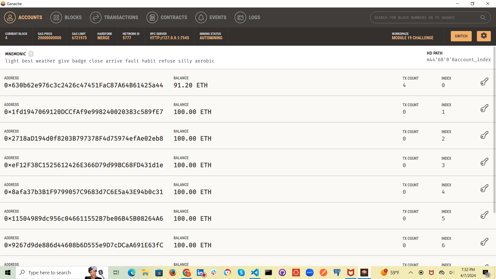
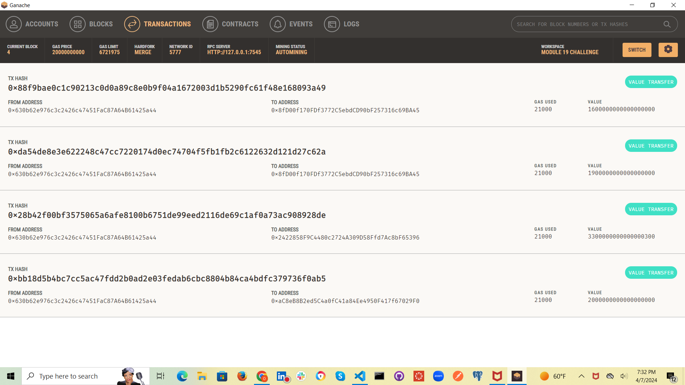
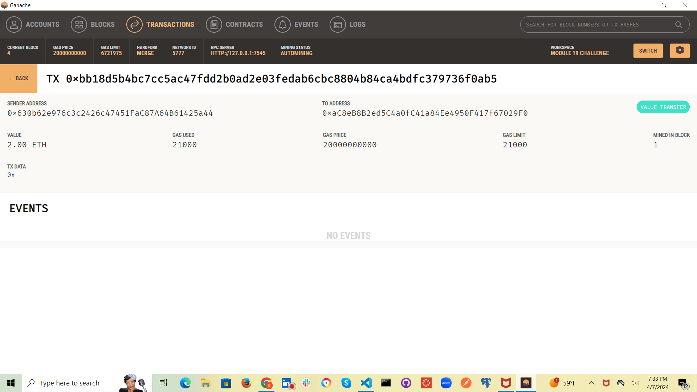
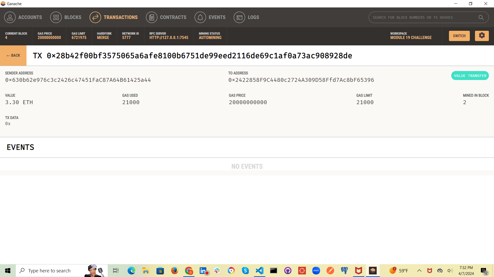
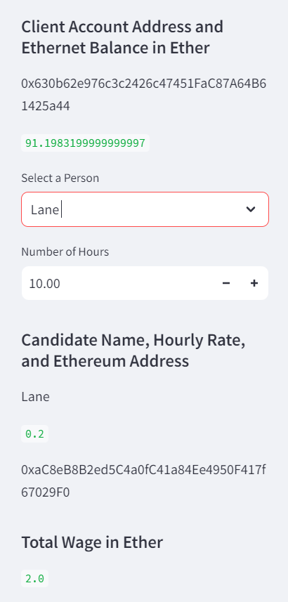

# fintech_finder.py

### Purpose of Project

The main purpose of this project is to demonstrate an ability build a cryptocurrency wallet as well as a program to find, contract, and pay fintech professionals for projects. Ganache was used to establish test ethereum accounts to demontrate capabilities

### Technologies

The following libraries are used in this analysis:
* streamlit
* ganache
* dataclasses
* typing
* web3

## Images

### Ganache Screenshots

### Streamlit Screenshots

